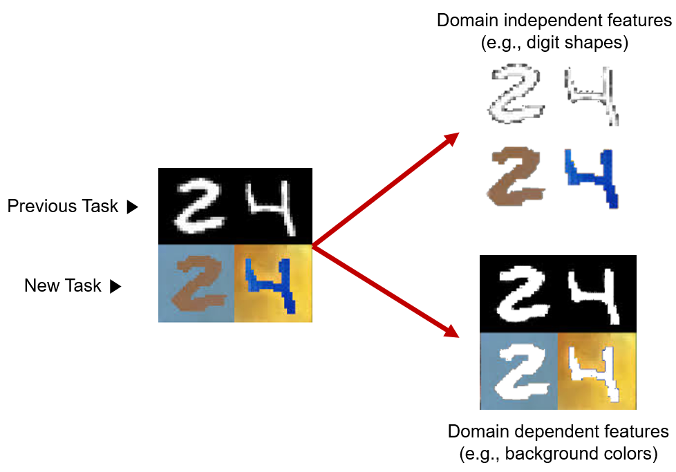
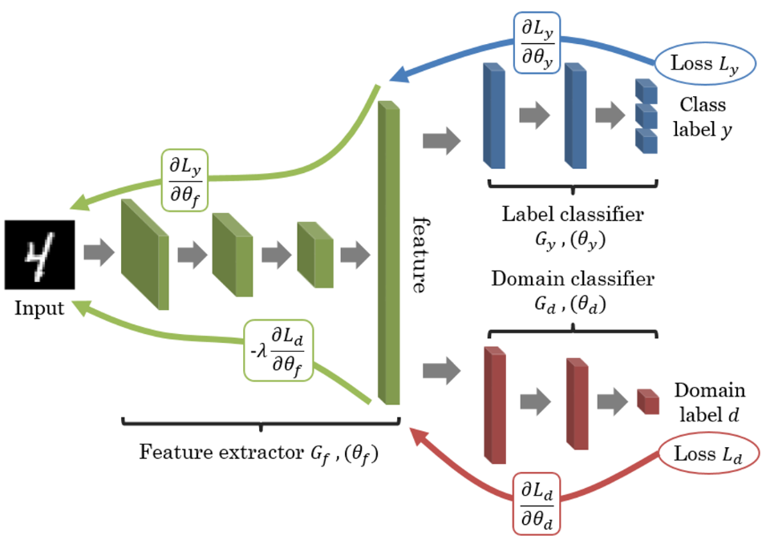
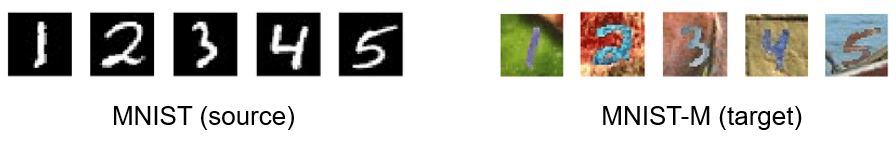

# DANN

A Tensorflow implementation of **Domain Adversarial Neural Networks** (DANN, in short), introduced in paper titled [**"Unsupervised Domain Adaptation by Backpropagation"**](https://arxiv.org/pdf/1409.7495.pdf). 

---
## What is Domain Adapatation?

**Domain adaptation** is a field associated with **transfer learning**.

<p align="center"></p></br>

Perhaps the most famous example of such a methodology is the **Domain-Adversarial Neural Network (DANN)**. This network simultaneously does the two things: **label classification** and the **domain classification**. The main purpose of calculating the domain loss is to force the feature extractor to exclude the domain-dependent features since they are uninformative in a similar problem space, so that the model automatically figure out the essential spots in the feature map. It contains a gradient reversal layer, and this makes sure that samples are mutually indistinguishable for the domain classificatory. So the best model will be the one with minimizing the classification loss while maximizing the domain confusion loss for all samples as possible.

<p align="center"></p></br>

---
## Preparation

### Installing prerequisites

To install the prerequisite, simply type in the shell prompt the following:

```
$ pip install -r requirements.txt
```

You can use TensorFlow libraries with GPU support (See the guide at [TensorFlow tutorials](https://www.tensorflow.org/guide/gpu?hl=en)) to accelerate your code with CUDA back-end.

### Dataset

We prepared 2 different handwritten digit datasets, one for the source and the other for the target domain:



* [MNIST](http://yann.lecun.com/exdb/mnist/) : A well-known monochrome digit image set to be utilized to build the initial digit classifier.  
* [MNIST-M](http://yaroslav.ganin.net/) : MNIST-M is created by combining MNIST digits with the patches randomly extracted from color photos of BSDS500 as their background.

### Note

Since the size of the MNIST-M dataset is too large to upload here, you want to click this [link](https://drive.google.com/file/d/1tOMWeDpuRFWLJWKswDliMlxl7UkfFaye/view) to download the MNIST-M dataset. Once you obtain `mnistm_data.pkl`, move it to the directory named `dataset`. 

---
## Experiment

The effectiveness of DANN was verified in below. With the different digit image sets, you can test (See `test.ipynb`) how much performance DANN method can improve from the baseline results (source only). Compared to the results (0.966) with target image/label, which can be regarded as the optimal performances, the accuracies of 'source only' model (0.469) are fallen to near half of the previous cases. But, you can see the improvement in accuracies after employing domain adaptation skills.

| Training Mode | Target Accuracy |
| ------ | ------------------ |
| Train on target | 0.966 |
| Source Only | 0.469 |
| DANN | **0.847** |

</br></br>Also, check the t-SNE visualization results on the extracted features, and the effect of adaptation on the distribution of the extracted features. Blue points correspond to the source domain examples, while red ones correspond to the target domain. The adaptation makes the two distributions of features much closer.


